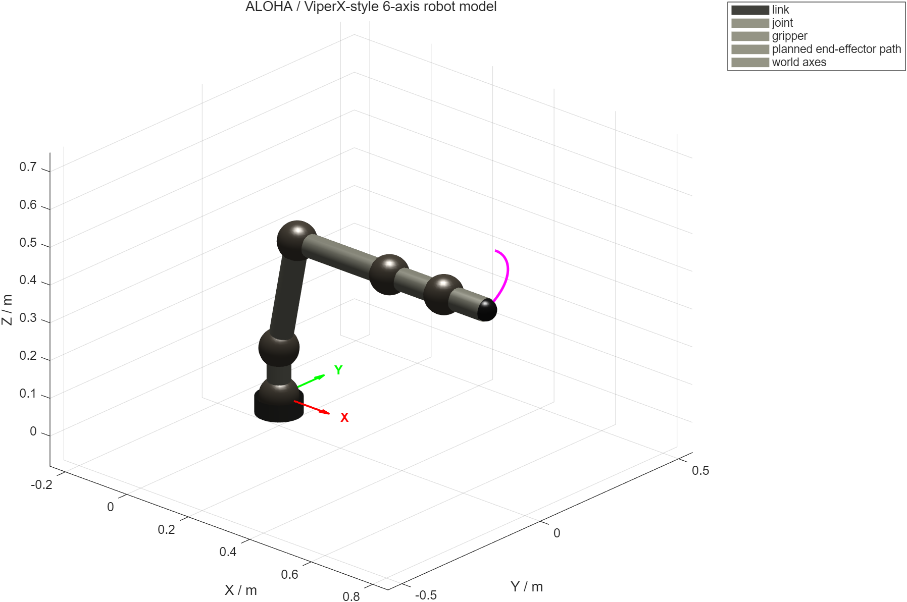
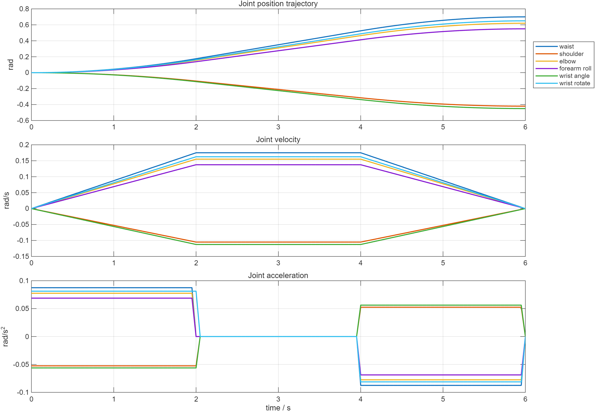
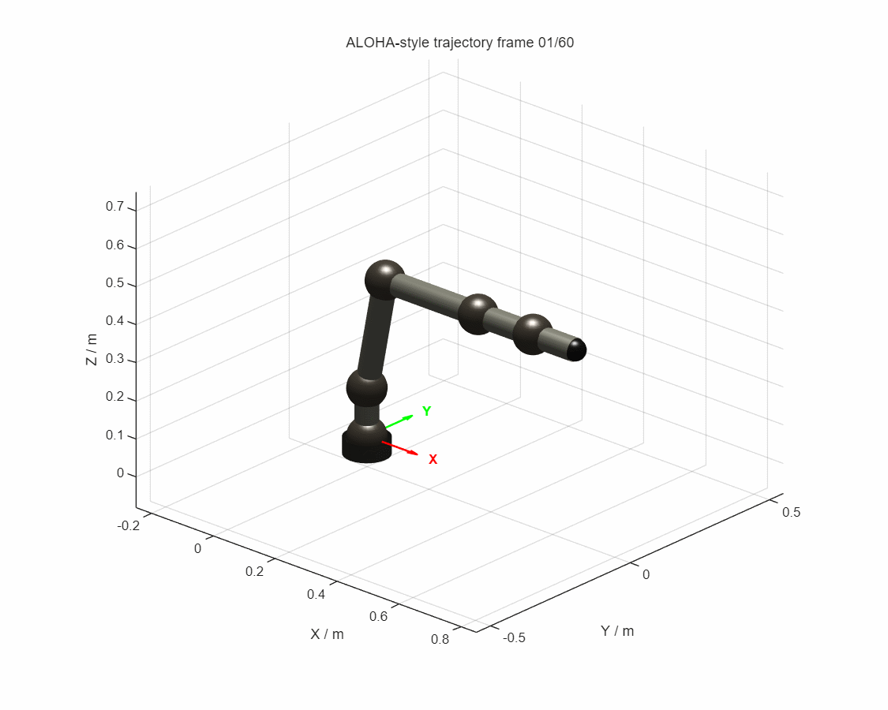

很多机器人课程设计最后只剩下一张“机械臂动起来了”的截图，真正难复现的是截图背后的链路：模型怎么定义、目标位姿怎么得到、轨迹是否平滑、仿真信号如何传进 Simulink，以及结果能不能再次导出。

这篇文章记录我在 [course-design 仓库](https://github.com/qing-2114/course-design/tree/main/MATLAB_Simulink_Aloha_Robot) 中整理的一个完整闭环：用 MATLAB Robotics System Toolbox 建立类 ALOHA/ViperX 的六自由度机械臂，完成正逆运动学和关节空间轨迹规划，再把轨迹送进 Simulink 与 Simscape Multibody，最后输出姿态图、轨迹曲线和 GIF 动画。

> 这是一套面向课程设计展示的仿真模型。仓库没有连接真实 ALOHA 硬件，也没有视觉识别、遥操作或真实夹爪控制。文中的“ALOHA/ViperX”表示外形和关节布局参考，尺寸是便于演示的近似参数。

## 先看结果

姿态图同时画出了机械臂当前姿态、世界坐标轴和末端执行器的规划路径。紫色曲线就是末端在关节轨迹下扫过的空间轨迹。



轨迹结果不是只画位置。程序把六个关节的位置、速度和加速度分成三组曲线，便于检查轨迹是否连续、是否存在突跳。



最后将 60 个采样帧写成循环 GIF。它更适合放在课程报告或项目 README 中，快速展示从 home 姿态到目标姿态的运动过程。



## 项目的最小闭环

整个演示由 `run_all.m` 进入，实际工作集中在 `main_demo.m`：

```text
createPictureRobot
        ↓
home/goal 位姿（正运动学）
        ↓
solveRobotIK（位置逆解）
        ↓
planJointTrajectory（梯形速度）
        ↓
Simulink 轨迹信号仿真
        ↓
Simscape Multibody 模型生成
        ↓
PNG 曲线 + GIF 动画
```

这样的顺序很重要：先固定机器人模型和坐标系，再规划关节轨迹；可视化只是最后一步，不应该反过来“为了让动画好看”修改运动学数据。

## 1. 用 `rigidBodyTree` 搭六个关节

`createPictureRobot.m` 使用行向量数据格式创建 `rigidBodyTree`，并设置重力为 `[0 0 -9.81]`。六个旋转关节的顺序是：

| 顺序 | 关节名 | 转轴 |
| --- | --- | --- |
| 1 | `waist` | Z 轴 |
| 2 | `shoulder` | Y 轴 |
| 3 | `elbow` | Y 轴 |
| 4 | `forearm_roll` | X 轴 |
| 5 | `wrist_angle` | Y 轴 |
| 6 | `wrist_rotate` | X 轴 |

连杆平移使用米为单位，例如底座到肩部约 `0.12705 m`，肩部到肘部约 `0.30000 m`，末端夹爪长度约 `0.13600 m`。这些数字的目的，是保持类 ViperX 的可视比例，同时让课程作业中的参数容易阅读和调整。

代码把关节限位也写进模型，而不是只在文字里说明：肩关节约为 ±101°，肘关节约为 `[-101°, 92°]`，腕部关节分别使用各自的角度范围。这样后续调用逆运动学时，求解器可以在模型约束内搜索。

## 2. 正运动学先给出可验证的目标

主程序将 home 姿态设为六个零角，并指定一个演示目标：

```matlab
qHome = zeros(1, 6);
qGoal = [0.70, -0.42, 0.62, 0.55, -0.45, 0.65];
endEffector = "gripper_link";
```

目标不是手写一个容易和模型不一致的 XYZ 坐标，而是先对 `qGoal` 做一次正运动学：

```matlab
goalPose = getTransform(robot, qGoal, endEffector);
targetPosition = tform2trvec(goalPose);
```

然后再把这个位置交给逆运动学。这样可以形成一个很清楚的自检：如果 IK 返回的末端位置和 `targetPosition` 之间误差很小，说明模型、关节顺序和求解器至少在位置层面是一致的。

## 3. 逆运动学：先解决位置，再谈姿态

`solveRobotIK.m` 使用 Robotics System Toolbox 的 `inverseKinematics`。目标变换由 `trvec2tform` 构造，权重设置为：

```matlab
weights = [0.2 0.2 0.2 1 1 1];
[qSol, ikInfo] = ik(endEffector, targetPose, weights, qInitial);
```

这里将位置误差的权重设为 1，将姿态误差的权重设为 0.2，让求解器优先贴合目标位置。求解后程序重新计算 `getTransform(robot, qSol, endEffector)`，并打印位置误差。报告中应该同时保留 `ikInfo.Status` 和误差数值，而不是只写“求解成功”。

需要注意：这不是完整的抓取规划。目标姿态没有从视觉或任务规划器来，夹爪也没有建模成可开合机构；它更适合作为学习“模型—目标—求解—验证”这条运动学链路的最小例子。

## 4. 用梯形速度让关节平滑起停

轨迹函数 `planJointTrajectory.m` 将起点和终点组成两个 waypoint，调用 `trapveltraj` 生成位置、速度和加速度：

```matlab
t = 0:0.05:6;
waypoints = [qStart(:), qGoal(:)];
[q, qd, qdd] = trapveltraj(waypoints, numel(t), "EndTime", 6);
```

采样时间为 `0.05 s`、总时长为 `6 s`，因此得到 121 个时间采样点。梯形速度曲线的优点是起步和停止阶段不会突然跳变，生成的 `q`、`qd`、`qdd` 还能直接拿来做曲线检查和后续控制输入。

## 5. Simulink 只负责把信号跑一遍

`buildRobotSimulinkModel.m` 会自动创建 `picture_robot_simulink.slx`：一个 From Workspace 模块读取名为 `qCommand` 的六关节 `timeseries`，再通过 To Workspace 输出 `qSim`。主程序中的关键连接是：

```matlab
qCommand = timeseries(qTraj, t);
assignin("base", "qCommand", qCommand);
simOut = sim(modelName, "StopTime", "6");
qSim = simOut.qSim;
```

这个模型有意保持简单。它验证的是“规划轨迹能否按时间送入 Simulink 并被记录”，不是动力学控制器或硬件在环测试。后续如果要扩展，可以在 From Workspace 和 To Workspace 之间加入关节限幅、控制器、扰动或传感器模型，再比较 `qCommand` 与 `qSim`。

## 6. Simscape Multibody 和结果导出

多体模型由 `buildRobotMultibodyModel.m` 自动生成，输出 `picture_robot_multibody.slx`。同一套 `rigidBodyTree` 参数还被用于绘图：程序用圆柱表示连杆、球体表示关节，并将末端位置逐帧连成路径。

GIF 导出时从整条轨迹中均匀抽取 60 帧，第一帧创建文件，后续帧以 append 方式写入。这种做法比导出全部 121 帧更适合网页展示，也保留了足够的运动连续性。

## 如何复现

建议使用 MATLAB R2022b 或更新版本，并安装：

- Robotics System Toolbox
- Simulink
- Simscape Multibody

在 MATLAB 中进入 `MATLAB_Simulink_Aloha_Robot` 目录，运行：

```matlab
run_all
```

运行完成后，`figures/` 会包含姿态图、关节轨迹图和 GIF；同时会生成或更新两个 `.slx` 模型。只想看实时绘制窗口时，也可以运行：

```matlab
viewRobotLive
```

## 从课程设计继续往前走

这个项目已经把最容易断裂的几步连起来了，但它仍然是一个“运动学与仿真演示”，而不是完整机器人系统。比较自然的下一步有三条：

1. 给末端增加固定姿态约束，比较不同权重下的 IK 解和可达性。
2. 在 Simulink 中加入 PID 或 computed-torque 控制器，记录跟踪误差和关节力矩。
3. 将目标位姿从视觉、示教器或 ROS 话题输入，补上任务层闭环。

课程设计最值得保留的，不只是最后的 GIF，而是这条可检查的证据链：参数有来源、轨迹有时间轴、仿真有输入输出、结果有误差指标。做到这一点，项目才从“看起来能动”变成“别人能够复现和继续修改”。

项目源码与原始结果：<https://github.com/qing-2114/course-design/tree/main/MATLAB_Simulink_Aloha_Robot>
