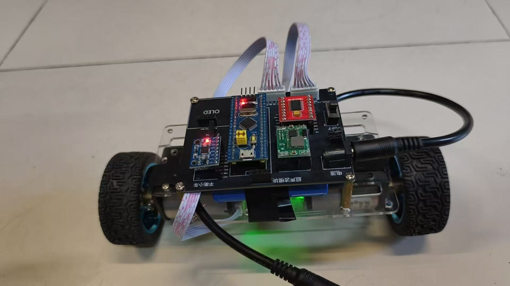

两轮直立小车看起来像一个“会自己站起来”的玩具，真正动手后才会发现，它同时考验机械装配、传感器读取、离散控制和实时中断。2025 年 10 月，我把这些环节整理成了一个可以在 STM32 上运行的工程：[BalanceCar_STM32](https://github.com/qing-2114/BalanceCar_STM32)。这篇文章记录仓库当前版本的结构和思路，方便之后复现、调参和继续迭代。



先说明文章的证据边界：仓库最新提交时间是 2025-10-18，源码中包含完整的 CubeMX/Keil 工程、PID 与 LQR 两个固件目录，以及用于计算 LQR 增益的 MATLAB 脚本。仓库没有提交串口曲线、倾倒次数或承载测试等实验记录，因此下文不会把“能够编译”写成“已经达到某个稳定时长”。

## 硬件和工程结构

工程的 MCU 是 STM32F103C8T6（72 MHz，LQFP48）。CubeMX 配置使用三个定时器：TIM1 的 CH1/CH4 输出左右电机 PWM，TIM2 和 TIM4 以编码器接口模式读取左右轮。电机方向由 PB12～PB15 的四个 GPIO 控制，PWM 自动重装值为 `7200-1`、预分频为 `200-1`。

传感器部分使用 MPU6050。DMP 提供 `pitch/roll/yaw` 姿态角，陀螺仪原始数据用于角速度，编码器则提供轮速增量。PB5 配置成下降沿 EXTI，中断回调里调用 `Control()`；LQR 版本把这条控制链固定为 5 ms 一次，也就是 200 Hz。主循环本身保持空闲，实时任务由外部中断触发：

```c
void HAL_GPIO_EXTI_Callback(uint16_t GPIO_Pin)
{
    if (GPIO_Pin == GPIO_PIN_5) Control();
}
```

上电初始化顺序是 `MPU_Init()`、`mpu_dmp_init()`、开启 EXTI、启动 PWM，最后清零并启动两个编码器。这种顺序先让传感器和执行器进入可用状态，再放开控制中断，能避免初始化阶段误触发输出。

## 先用 PID 把车“扶起来”

`BalanceCar-PID-INT` 将控制拆成三个环节：

- `VerticalPD`：以 roll 角和陀螺仪角速度为输入，负责直立；
- `VelocityPI`：对左右编码器和做低通、积分，负责前后速度；
- `TurnPD`：使用目标转向量和 z 轴角速度，负责差速转向。

代码中的默认参数是：直立 `Kp=-390、Kd=-2.4`，速度 `Kp=0.20、Ki=0.001`，转向 `Kp=10、Kd=0.6`。速度环输出会叠加到直立环的目标角度，左右 PWM 再减/加转向量。这个结构很适合作为第一版：先让小车在原地恢复直立，再逐步增加速度和转向目标。

调 PID 时建议一次只改一个环。先把 `Target_Speed` 和 `Target_Turn` 保持为 0，观察车体是否快速回正；再慢慢增加速度环积分，最后才加入转向。需要注意，当前 `Control()` 中调用 `PWM_Output_Limit(LeftVel, PWM_MAX)` 时没有把返回值重新赋给 `LeftVel`，如果输出越界，限幅实际上不会生效；同时，`PID.c` 的限幅函数在“没有越界”时也缺少显式的 `return output`。这两个问题都应在正式落地前修正：

```c
LeftVel  = PWM_Output_Limit(LeftVel, PWM_MAX);
RightVel = PWM_Output_Limit(RightVel, PWM_MAX);
/* PWM_Output_Limit() 函数末尾还应补上：return output; */
```

## LQR：把六个状态放进一个反馈律

`BalanceCar-LQR-INT/LQR/LQR.c` 使用状态向量

```text
X = [x, x_dot, theta, theta_dot, psi, psi_dot]^T
```

其中 `x` 是小车位移，`x_dot` 是线速度，`theta`/`theta_dot` 是 roll 角及角速度，`psi`/`psi_dot` 是偏航角及角速度。编码器增量先通过轮半径 `0.0336 m`、每转计数 `2464` 和采样周期 `0.005 s` 换算成线速度，再对速度积分得到位移；roll 和 yaw 则由角度与陀螺仪数据换算为弧度制。

LQR 增益来自 `LQR/LQR_BalanceCar.m`。脚本根据轮质量 `0.035 kg`、轮距 `0.195 m`、车体质量 `0.697 kg`、质心高度 `0.04 m` 等参数建立线性化的 `A、B` 矩阵，先检查 `rank(ctrb(A,B))` 是否为 6，再用

```matlab
Q = diag([10, 10, 500, 10, 1, 0]);
R = diag([1, 1]);
K = lqr(A, B, Q, R);
```

得到两路反馈增益。当前固件写入的矩阵为：

```text
K_left  = [-2.2361, -10.6162, -233.7351, -10.7707,  0.7071,  1.1528]
K_right = [-2.2361, -10.6162, -233.7351, -10.7707, -0.7071, -1.1528]
```

每个 5 ms 周期计算状态误差 `delta_X = X - X_Ref`，再求左右轮加速度修正量。速度命令最终乘以 `kp=2.3` 和 PWM 满量程 `7200`，并经过限幅后交给 `MoveControl()`。与 PID 的多环结构相比，LQR 的优点是可以在同一个代价函数里平衡位移、速度和姿态；代价是模型参数、坐标符号和采样周期必须保持一致。

这里还有一个重要的实现边界：虽然状态向量和增益矩阵保留了 yaw 两项，但当前 `delta_X` 把最后两项写成了 `0`，并明确注释为暂不使用 yaw 反馈。因此这版 LQR 实际主要稳定前后直立，偏航项只是为后续扩展预留，并不等于已经完成了完整的航向控制。

## 电机输出和符号检查

`MoveControl()` 将速度命令拆成方向和占空比：正值设置对应 H 桥方向引脚，负值反向，并把绝对值写入 TIM1 比较寄存器。左右电机分别使用 PA8（CH1）和 PA11（CH4）输出 PWM。

第一次上电时不要直接把车放到地面。可以让轮子悬空，轻轻向前倾斜车体，确认轮子是否朝“试图回正”的方向转动；如果方向相反，优先检查编码器正负号、roll 角符号和电机方向引脚，而不是盲目增大增益。`Encoder.c` 对右轮计数取了负号，说明左右安装方向已经在软件中做过一次约定。

## 推荐的复现步骤

1. 使用 STM32CubeMX 6.15 打开 `BalanceCar.ioc`，确认芯片、TIM1 PWM、TIM2/TIM4 编码器和 PB5 EXTI 配置。
2. 在 Keil MDK-ARM 5.32 中打开对应的 `MDK-ARM/BalanceCar.uvprojx`，先编译 PID 版本，确认基础驱动和电机方向正常。
3. 悬空测试编码器计数和 MPU6050 姿态输出，再以较小 PWM 做短时落地测试。
4. 将 PID 参数和 LQR 增益分开记录，每次只改变一个参数，并保存“能否站立、恢复时间、最大 PWM”等可复现实验信息。
5. 需要重新设计 LQR 时，先在 MATLAB 中修改物理参数和 `Q/R`，确认系统可控后，再把打印出的 `K` 复制到 C 文件。

## 下一步可以怎么改

这份仓库已经把“传感器—状态估计—控制器—PWM—电机”的主链路串起来了。下一步最有价值的改动不是继续堆功能，而是补齐可观测性：通过串口输出 roll、角速度、编码器速度、控制量和电池电压，记录一次真实起立过程，再据此调整模型和权重。之后可以把 yaw 两个状态接回 `delta_X`，加入遥控指令和软启动，并为低电压、传感器异常和小车倒地增加安全停机逻辑。

对我来说，这个项目最重要的收获是：平衡小车不是“把一个 PID 参数调到能动”就结束了。机械参数决定模型，采样周期决定离散控制，编码器和 IMU 的符号决定反馈方向，而日志决定我们能否解释一次失败。把这些环节逐一固定下来，STM32 上的两轮直立才真正成为一个可复现、可继续研究的工程。

项目源码：[qing-2114/BalanceCar_STM32](https://github.com/qing-2114/BalanceCar_STM32)
