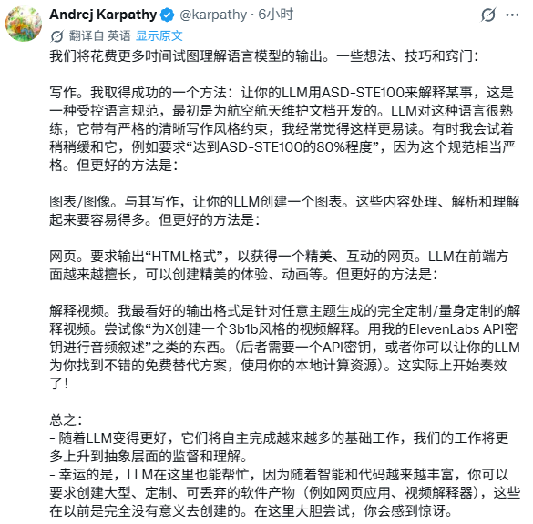
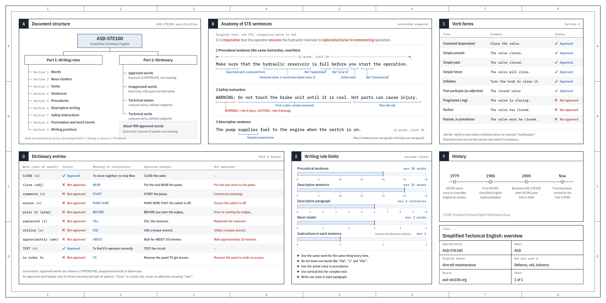

# AI 回答太难读？试试 Karpathy 提到的这几种解释方式

AI 几秒钟写完一大段解释，读的人却还得花时间拆术语、理关系。有时追问一句“再通俗一点”，只会得到另一段同样长的文字。

Karpathy 的一段分享给了一个很具体的思路。让模型按简化技术英语的规则写作，或者把答案做成图表、交互网页，甚至专门解释某个问题的视频。我们可以把“怎样解释”也交给模型处理。

## 先把一句话写明白

他提到的 ASD-STE100，是一套叫作“简化技术英语”的规范，最初服务于航空维修文档。维修说明要让不同语言背景的人准确理解，读者需要知道下一步做什么，不能靠猜。

这套规范有两部分，一部分管写作规则，一部分是词典。它会约束用词、句子结构和操作说明的写法，比如在操作步骤中使用主动语态。借鉴这种控制用词的思路，同一件东西尽量使用同一个名称，避免为了文采频繁换词。

看STE概览图中的例子就容易理解。它建议用 start 代替 commence。表达同一个动作，优先选读者更熟悉的词。

这也解释了为什么“写得专业”有时会妨碍理解。长词、名词堆叠和被动句挤在一起，读者要先把句子拆开，才能找到真正的动作。把动作和对象写清楚，往往比继续添加解释更有效。

Karpathy 在分享里提到，他有时会放宽要求，让模型做到这套规范的“80%”。这里的百分比是提示方式，不能当成经过测量的合规率。重点是借用它的写作约束，让解释更紧凑。

用于中文时，可以借鉴短句、用词一致、动作明确这些原则。英文规范里的字数限制和词典规则，不宜直接换算成中文标准。

## 关系太多，就让它画出来

文字变简单之后，有些内容仍然难读，因为要记住的关系太多。

STE概览图本身就是一个例子。左上角把整套规范分成“写作规则”和“词典”，下面再展开各自内容。读者先看到整体结构，再决定去读哪一块。若把同样的信息写成连续段落，就得一边读，一边记住每个部分属于哪里。

图里的词典表格又解决了另一种问题。一个词能不能用、该换成什么、例句怎样写，被放在同一行。需要比较时，视线横着扫过去就行。

这正是图表适合承担的工作。解释步骤，可以画流程；说明几个概念的从属关系，可以画结构图。选形式时先看读者需要找什么，不必把每个答案都塞进同一种模板。

当然，信息图也会拥挤。这张概览适合放大查阅，在手机上直接缩成一张小图，细字就很难读。排得下多少信息，和读者能看清多少信息，是两件要分别考虑的事。

## 网页和视频，多了什么

Karpathy 接着提到了 HTML 网页。它在图表之外，多了交互的空间。

静态图通常展示某个结果。交互页面可以让人调整条件，再观察结果怎样变化。对于需要理解变量关系的问题，这种形式值得尝试。读者能亲手改一次数值，看看原先的判断在什么条件下仍然成立。

他还提到按主题定制解释视频，并以 3Blue1Brown 风格作为例子。这个数学科普频道擅长用动画帮助观众理解抽象概念。视频能按顺序引入对象，让变化过程和讲解对应起来，减少读者同时处理的信息。

不过，定制视频还涉及画面、配音和生成工具。分享中也提到了语音 API 或本地替代方案。它更接近一项需要工具配合的制作任务，不能把一句提示词当成成片质量的保证。

这些形式各有适合的场合。查一个定义，几句文字就够；理解结构，图表很方便。需要反复改变条件时，交互页面才有发挥空间。视频则适合按时间展开的解释，但回查细节未必比文字快。

下次遇到一段难懂的 AI 回答，可以先指出自己卡在哪里。是术语不熟，还是关系绕不清？如果卡在变化过程，就让它把中间步骤展示出来。要求越贴近理解上的困难，模型才越容易选到有用的表达方式。

### 参考资料

- [ASD-STE100 官方介绍](https://www.asd-ste100.org/about_STE.html)
- [ASD-STE100 官方 FAQ](https://www.asd-ste100.org/STE_faq.html)
