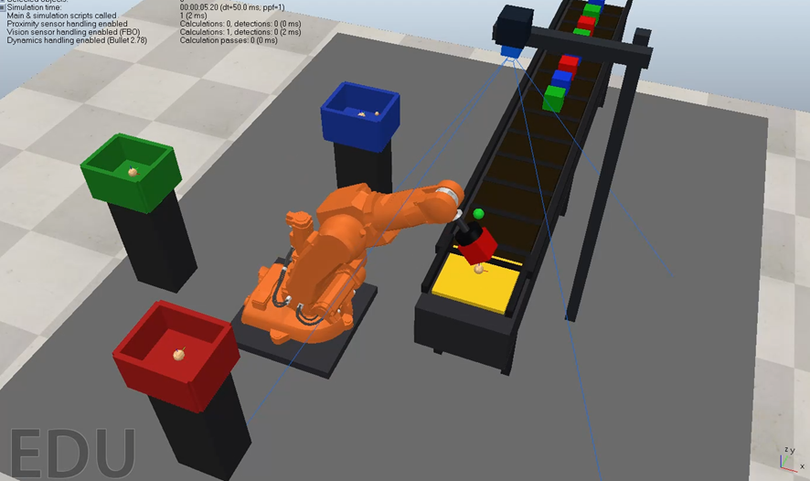
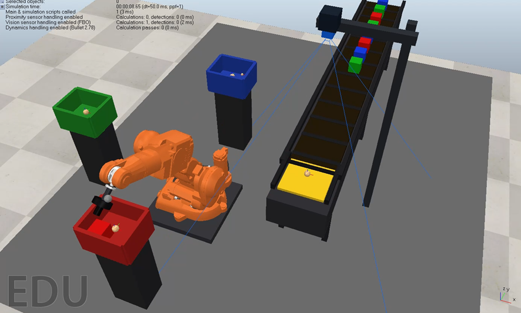

工业机器人课程设计最容易做成“机器人动起来了”的展示，却很难让它像一条小型产线一样，把上料、识别、抓取、搬运、放置和统计完整串起来。这个项目 [`coppeliasim-industrial-sorting-mvp`](https://github.com/qing-2114/course-design/tree/main/coppeliasim-industrial-sorting-mvp) 选择了一个边界清晰的目标：在 CoppeliaSim 中搭建 ABB IRB 140 颜色分拣单元，让传送带上的 9 个红、绿、蓝工件分别进入对应料箱。

先说明证据边界：本文的结构和代码解释来自仓库中的 `README.md`、`docs/MVP_design.md`、`scripts/build_industrial_sorting_mvp.lua` 与 `scripts/sorting_controller.lua`。仓库 README 记录的验证结果是 `total=9 success=9`，红、绿、蓝各 3 件；我在本次写作中完成了源码核对和静态构建文件检查，但没有替读者在本机启动 CoppeliaSim，因此不把这段记录写成当前环境下重新测得的实验数据。

## 先看清楚：这是一个怎样的闭环

场景被拆成四类对象：

| 模块 | 作用 |
| --- | --- |
| 上料模块 | 沿 Y 轴布置的传送带、导轨和 9 个工件 |
| 感知模块 | 黄色取料检测区与顶部视觉传感器 |
| 执行模块 | 官方 ABB IRB 140、吸盘和末端抓取点 |
| 分拣模块 | 红、绿、蓝三个低壁料箱与槽位 |

控制目标不是让工件依靠物理引擎“碰巧”落入箱子，而是由脚本确定性地移动工件和机器人。这样做很适合课程设计的 MVP：每次从相同初始状态开始，状态转移和成功计数都能复现；同时把碰撞物理的不确定性留在系统边界之外。

项目明确不依赖 ROS、Python Remote API 或外部 OpenCV。打开生成的 `.ttt` 文件、手动开始仿真，就能观察完整流程。场景生成脚本还会把官方机器人模型加载进来，删除原模型中可能干扰演示的脚本对象，并将几何体设置为静态、非响应，降低运动被碰撞卡住的风险。

## 用一台有限状态机管理一次抓取

`sorting_controller.lua` 没有把所有动作写成一段难以调试的连续代码，而是把一次分拣拆成明确状态：

```text
FEEDING → MOVE_ABOVE_PICK → MOVE_PICK → ATTACH
        → LIFT_FROM_PICK → MOVE_ABOVE_DROP → MOVE_DROP
        → RELEASE → LIFT_AFTER_DROP → RETURN_HOME
```

完成一个工件后，索引递增并回到 `FEEDING`；9 件全部处理后进入 `DONE`。每段运动由 `beginMotion` 记录起点、目标和持续时间，`stepMotion` 再用 cubic smoothstep 插值关节角：

```lua
u = t * t * (3.0 - 2.0 * t)
q[i] = qStart[i] + (qTarget[i] - qStart[i]) * u
```

相比直接跳到目标角度，缓动插值能让起停更自然，也更容易在日志中定位“机器人卡在哪一个阶段”。仓库还把最大关节速度设为原始设定的 70%，为吸盘和工件留出更宽松的观察时间。

## 颜色识别：读取材质，而不是猜名字

工件到达黄色检测区后，控制器调用 `sim.getObjectColor` 读取材质的 RGB 值，再比较三个通道的大小：R 最大判为红色，G 最大判为绿色，B 最大判为蓝色。如果颜色读取失败，脚本会记录 fallback 并使用工件的预期颜色，避免一次 API 异常让整场演示无声中断。

这个实现足够小，却保留了“感知—决策”的接口。真正接入相机算法时，可以只替换 `classifyFromRgb`，不必重写抓取、放置和统计逻辑。成功计数也不是“脚本处理过就算成功”：只有识别颜色与工件的 `expectedColor` 一致时，`stats.success` 才增加。

## simIK 负责求姿态，关节插值负责执行

项目的关键升级是把 `simIK` 放在初始化阶段，用它为取料点、取料上方和每个料箱槽位求出 ABB 的关节配置。`solveGripConfig` 会设置 `abb_ik_target`，调用 `simIK.handleGroup`，再检查吸盘抓取点与目标位置的距离；误差超过 `0.020 m` 就停止并报错。

运行时并不是每一帧都让 IK 追踪目标，而是先求好一组可用姿态，再在状态机中做关节空间平滑插值。这是一个很实用的折中：IK 解决“目标点对应哪组关节角”，插值解决“如何稳定地走过去”。控制器还把上一个配置作为下一个求解的 seed，并打开 `group_avoidlimits`，减少逆解跳分支和撞关节极限的概率。



## 三个槽位让“放进去”也可验证

每个料箱不是只有一个中心点。`dropSlotOffsets` 定义了四个偏移槽位，颜色计数决定当前工件使用哪一个槽位。释放前，脚本计算抓取点与目标槽位的三维距离；误差大于 `0.015 m` 时记录安全警告，否则写入对齐日志。放下后，工件被重新设为世界坐标系的子对象，并放到明确的槽位位置。

这种设计避免了常见的演示漏洞：画面看起来“放到了箱子附近”，但程序无法回答“是否真的放对了”。槽位坐标、颜色统计和最终日志共同构成了可检查的验收条件。



## 安全策略藏在布局和检查里

场景生成器把传送带和取料板放在 `x=0.760`，整体远离机器人底座；红、绿、蓝料箱分布在机器人周围，并使用较低的箱壁。水平移动前先经过“取料上方”或“料箱上方”姿态，携带工件时保持在传送带和箱壁之上。

运行时仍保留 `clearanceOk` 检查：抓取后抬升高度过低、搬运时工件底部过低、放置姿态可能穿过箱底，都会触发一次性的 `SAFETY warning`。这些检查不会替代碰撞检测，但能把“可能穿模”的问题转换成可搜索的日志证据。

## 如何运行与如何判断完成

在 PowerShell 中进入项目目录，运行场景构建脚本：

```powershell
cd coppeliasim-industrial-sorting-mvp
.\scripts\build_scene.ps1
```

脚本会生成 `output/industrial_sorting_mvp.ttt` 并执行加载检查。之后在 CoppeliaSim 中打开该场景，手动开始仿真。一次完整运行的验收重点不是“看见机械臂动了”，而是同时检查：

1. 日志是否出现 `[mvp] COMPLETE total=9 success=9`；
2. `red`、`green`、`blue` 计数是否各为 3；
3. 是否出现安全警告或 `IK failed`；
4. 工件是否分别停留在三个料箱的槽位内。

## 这个 MVP 下一步还能做什么

如果要把它从课程演示推进到更接近产线的实验，可以沿着三条线扩展：把 RGB 最大通道分类换成视觉传感器图像与阈值分割；把预采样姿态换成带速度、加速度约束的轨迹规划；再加入工件漏检、抓取失败和传送带堵塞等异常状态。

但每次改造都应该保留当前的验收指标。先让 `total/success/颜色计数/安全告警` 继续可追踪，再增加更复杂的感知或规划，才能知道改动究竟提升了系统，还是只是让动画更热闹。

这个项目最值得借鉴的地方，正是它把“机器人分拣”收敛成一条可解释的工程链路：场景生成保证可复现，颜色读取提供决策输入，simIK 给出可达姿态，状态机安排动作，安全检查和统计日志负责验收。对于第一次搭建 CoppeliaSim 工业单元的人来说，这比堆叠更多模型更重要——先让每一个状态都能被看见、被记录、被验证，再去追求更复杂的真实感。
