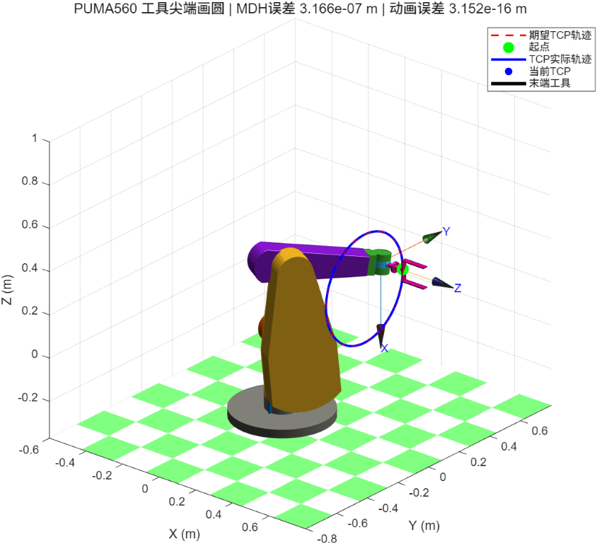

机器人“画圆”是一个很适合用来检验运动学模型的实验：轨迹的几何形状足够直观，误差又可以用一个明确的数值衡量。这个项目使用 MATLAB Robotics Toolbox 建立 PUMA560 的 Modified DH（MDH）模型，让六轴机械臂的工具中心点（TCP）沿着 Y-Z 平面上的圆运动，并把期望轨迹、实际轨迹和末端工具一起显示出来。

项目源码：[`qing-2114/course-design/puma560-mdh-circle-demo`](https://github.com/qing-2114/course-design/tree/main/puma560-mdh-circle-demo)



截图中的标题给出了本次运行的两个结果：MDH 模型的最大位置误差约为 `3.166e-07 m`，动画阶段的 TCP 最大误差约为 `3.152e-16 m`。前者来自 MDH 模型的数值逆解，后者是在可视化模型上重新求解并计算工具尖端位置得到的结果。它们是代码运行时的观测值，不是理论上对所有环境都恒定不变的精度保证。

## 先把问题说清楚：TCP 要画什么圆

`draw_circle_trajectory.m` 将圆定义在 Y-Z 平面，X 坐标保持不变。设圆心为

圆心可以直接记作 `c = [0.45, 0, 0.35]ᵀ m`。

直径为 `0.5 m`，半径就是 `0.25 m`。对参数 `θ` 采样后，轨迹点可以写成下面的列向量（这里使用普通文本公式，便于博客在没有数学公式插件时正常显示）：

```text
p(θ) = [ 0.45,
          0.25·cos(θ),
          0.35 + 0.25·sin(θ) ]ᵀ m
```

这一定义带来三个好处：圆的几何约束简单，轨迹点容易复现，而且可以直接用位置误差验证。脚本默认取 `72` 个关键点；动画时把点数扩展到 `72 × 8 = 576` 帧，让运动看起来更连续。

除了位置，轨迹还需要一个姿态。代码给每个采样点使用相同的 `tool_R = roty(pi/2)`，也就是让 TCP 在沿圆运动时保持固定工具姿态。这样实验关注的就是“末端位置是否走过圆”，而不是让末端姿态随切线方向变化。

## 用 Modified DH 参数建立 PUMA560

`puma560_mdh.m` 使用 Robotics Toolbox 的 `Link(..., 'modified')` 创建六个关节。模型中最关键的几何尺寸为：

| 参数 | 数值 |
| --- | ---: |
| \(a_2\) | `0.4318 m` |
| \(a_3\) | `0.0203 m` |
| \(d_3\) | `0.15005 m` |
| \(d_4\) | `0.4318 m` |

这里的“modified”非常重要。标准 DH 与 MDH 的参数排列和坐标变换顺序不同，不能只把一张参数表复制过来、再把 Link 类型改一下。项目把每一节连杆的 \(\alpha\)、\(a\)、\(d\) 和关节变量明确写入 MDH 链，并为六个关节设置了角度范围。这样做的目的，是让正运动学 `fkine`、逆运动学和关节约束使用同一套坐标约定。

在安装好 Peter Corke Robotics Toolbox 和 Optimization Toolbox 后，可以先在 MATLAB 命令行检查：

```matlab
which SerialLink
which SE3
which fminunc
```

如果 `SerialLink` 不存在，主脚本会直接给出依赖提示，而不是在中途产生难以定位的错误。

## 从圆轨迹到关节轨迹：逐点求逆

圆轨迹给出的是一组笛卡尔位姿 `Tₖ`，机械臂真正需要执行的却是关节角 `qₖ`。主脚本为每个轨迹点调用 `solve_ik`，而 `solve_ik` 内部封装了 `robot.ikunc(T, q0)`：

1. 用一个初始关节姿态作为第一个点的种子；
2. 求出当前点的逆解后，把它作为下一个点的初值；
3. 如果某个点没有得到有效解，就立即停止并报告失败点。

把上一个解传给下一个点，是这个示例中很实用的小细节。它能帮助数值优化器沿着连续的关节分支前进，减少相邻采样点突然跳到另一组逆解的概率。求得 `q_mdh` 后，脚本再次调用 MDH 模型的 `fkine`，计算

误差定义为 `eₖ = ‖p_fk(qₖ) − pₖ‖₂`，也就是正运动学算出的 TCP 位置与目标位置之差的欧氏范数。

并记录所有点中的最大值 `max(err_mdh)`。截图中的 `3.166e-07 m` 就是这一步的运行结果。

## 为什么动画还要使用另一套模型

项目中有一个容易被忽略、但很值得说明的设计：

- 运动学计算使用自定义的 `puma560_mdh`；
- 三维外观使用 Robotics Toolbox 自带的 `mdl_puma560`；
- 两者都代表 PUMA560，但参数表达和可视化实现并不完全相同。

动画阶段先用 `p560.ikine6s`（失败时回退到数值 `ikine`）为更密集的轨迹求解关节角，再用 `unwrap_joint_trajectory` 消除关节角跨过 `2π` 时的跳变。随后暂时把 `p560.tool` 设为单位矩阵计算法兰盘位姿，并手动沿法兰盘的 z 轴加上 `0.12 m` 工具长度：

```text
p_TCP = p_flange + 0.12 · R_flange(:, 3)
```

这种写法把“机器人法兰盘”和“实际工具尖端”区分开来，也让黑色末端工具线段能在动画中被单独画出。动画误差用同样的欧氏距离计算。截图显示的 `3.152e-16 m` 接近双精度浮点数的数值极限，说明在当前这次运行中，计算出的 TCP 基本落在目标采样点上；它不应被解读为真实机械臂硬件的绝对定位精度。

## 可视化结果应该怎么看

图中各元素的含义如下：

- 红色虚线：期望的 TCP 圆轨迹；
- 绿色圆点：轨迹起点；
- 蓝色实线：动画过程中实际记录的 TCP 轨迹；
- 蓝色圆点：当前帧的 TCP 位置；
- 黑色线段：从法兰盘到工具尖端的 `0.12 m` 工具。

绿色网格和加高的灰色底座属于可视化辅助对象，不参与 MDH 参数或误差计算。标题中的误差指标、图例和坐标轴则把“轨迹目标”“当前状态”和“验证结果”放在了同一张图里，便于检查模型是否真的完成了任务。

## 如何运行与继续改造

进入项目目录后，在 MATLAB 中执行：

```matlab
run('main_script.m')
```

也可以使用批处理模式：

```bash
matlab -batch "run('main_script.m')"
```

想做进一步实验时，可以优先修改几个相互独立的参数：把 `center` 改到工作空间的其他位置，改变 `diameter` 测试可达范围，增加 `num_points` 观察逆解计算量，或调整 `tool_length` 检查工具偏置对 TCP 的影响。每次修改后都应同时查看动画和命令行中的三个误差量：MDH 轨迹误差、可视化逆解误差和最终动画 TCP 误差。

还可以把固定姿态改成随圆切线变化的姿态，或者把 `interpolate_trajectory.m` 用于关节空间插值。不过，这两项改动会改变实验问题本身：前者增加姿态跟踪约束，后者不再是对每个笛卡尔轨迹点逐帧求逆。先明确验证目标，再选择插值或求解方式，结果才有可比性。

## 小结

这个 PUMA560 示例的价值不只在于“画出了一个圆”。它把机器人学里一条完整的验证链路串了起来：用 MDH 参数描述机构，用几何公式生成笛卡尔目标，用逆运动学得到关节轨迹，再通过正运动学和动画记录检查 TCP 误差。

当你需要调试自己的机械臂模型时，也可以沿用同样的顺序：先固定坐标约定，再验证单点位姿，最后增加轨迹和动画。只要把“看起来在动”转换成“误差可以计算、参数可以复现”，可视化就真正成为了运动学模型的测试工具。
