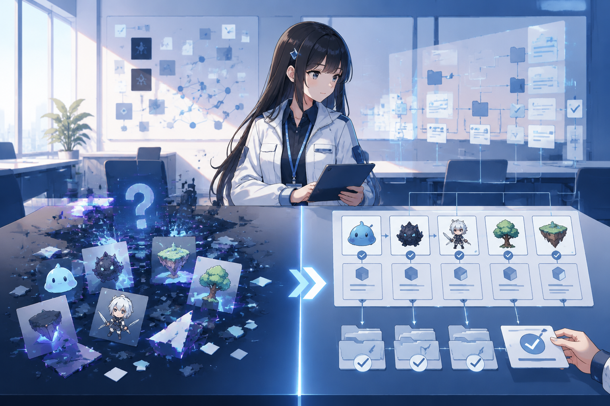

AI 社区里有一个越来越常见的判断：通用型 Skill 正在被模型“吃掉”。

过去我们给模型准备搜索 Skill、代码解释 Skill，甚至把“先分析、再调用工具、最后总结”写成固定流程。现在，Claude、GPT、Grok 等前沿模型已经能理解复杂指令、拆解任务、调用工具、执行代码，并在出错后自动重试。很多事情直接交给模型就能完成。

那 Skill 还有必要吗？

我的判断是：Skill 不会消失，但它的价值正在迁移。纯提示词、重复模型原生能力的通用 Skill 会越来越没优势；而连接真实工具、沉淀专业知识、保证交付质量的专业 Skill，反而更重要了。

## 模型正在“吃掉”哪些通用能力

最明显的变化，是模型不再只是问答接口。它们已经具备一套通用工作能力：理解目标、拆分步骤、选择工具、执行操作、检查结果，再根据反馈调整方案。

以前需要专门写一个搜索 Skill，告诉模型去哪里搜、怎么提取、怎么组织答案。现在，前沿模型已经能完成基础搜索和总结。代码解释、格式转换、任务规划也逐渐变成默认能力。

如果一个 Skill 只是把模型本来就会做的事重新描述一遍，它带来的可能不是能力提升，而是更长的上下文和更慢的执行速度。

从这个角度看，“通用 Skill 正在衰退”并非没有道理。

## 模型会做，不等于能稳定交付

但模型“能完成一次”，不等于“能稳定完成一百次”。

让模型生成一张游戏角色图不难，真正难的是让几十张图中角色保持一致，文件尺寸、命名、目录结构和透明通道都符合项目要求，并能直接进入游戏引擎流程。让模型调用一个 API 不难，真正难的是处理权限、超时、重试、幂等性和错误回滚。让模型写一份报告不难，真正难的是引用可追溯、数字经过核查、格式符合规范，关键结论保留人工确认。

这些不是模型完全不会，而是需要长期稳定的规则、工具和状态。模型擅长临场推理，Skill 则把不能每次临场发挥的部分固定下来。

Skill 的核心价值，正在从“教模型一个新技巧”，转向“为模型设置专业边界，让它可靠地完成一类工作”。

## Skill 的下半场：不是提示词，是基础设施

低价值 Skill 往往只有一段角色设定加几条说明：“你是搜索专家，请先搜索，再总结。”

高价值 Skill 更像一个小型工作系统——专业知识、工具接口、输入输出协议、状态保存、结果验证和权限控制，缺一不可。

这也是为什么游戏资产、垂直 API、科研分析、企业审批等方向仍然需要 Skill。模型负责理解语言和初步判断，Skill 保证结果符合具体项目的约束。两者的关系可以这样理解：模型负责通用智能，Skill 负责专业约束；模型生成可能性，Skill 把可能性变成可交付结果。

真正有壁垒的 Skill 未必比模型“更聪明”，但一定更了解某个真实场景——数据从哪来、工具怎么调、失败后怎么办、什么结果算合格、什么时候必须交给人确认。

## 哪些 Skill 会被淘汰，哪些值得建设

三类 Skill 最容易被模型吸收：只是重新包装常见知识的**通用知识型**，没有额外工具和验证机制的**简单流程型**，以及把模型偶尔做到的效果包装成稳定系统的**过度承诺型**。

但这不意味着所有通用 Skill 都失去了意义。对于能力较弱的模型、本地部署、需要统一输出格式的团队，通用 Skill 仍然能降低沟通成本——只是它的价值更多在标准化和可复用，而不在提供模型没有的智能。

开发一个 Skill 之前，值得先问几个问题：模型原生能力是否已经够用？它是否连接了真实数据或工具？是否减少了失败和返工？能否保存长期状态？有没有明确的质量标准？高风险操作是否保留了人工确认？

如果这些问题都没有答案，这个 Skill 大概率只是一段更长的提示词。反过来，如果它能把专业知识、工具链和验证流程组合到一起，即使模型继续升级，它仍然有价值——因为模型会迭代，但一个组织的流程、数据和责任边界不会自动消失。

## 结语

“通用 Skill 正在被模型吃掉”这句话，揭示的不是 Skill 的终结，而是一次生态筛选。

模型越来越像通用大脑，简单的能力包装自然失去稀缺性。未来值得建设的 Skill，不是再教模型搜索、总结或写代码，而是让模型在某个专业领域中长期、稳定、可追溯地完成任务。

Skill 的下半场，不是和模型比谁更聪明，而是回答一个更现实的问题：如何把模型的聪明，变成可靠的生产力。
