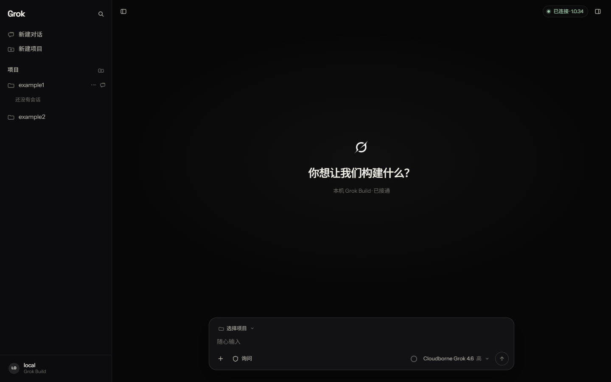
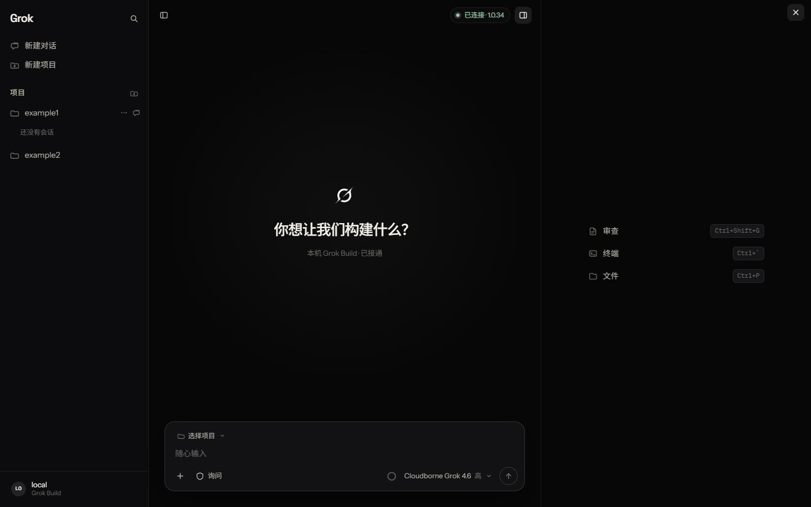
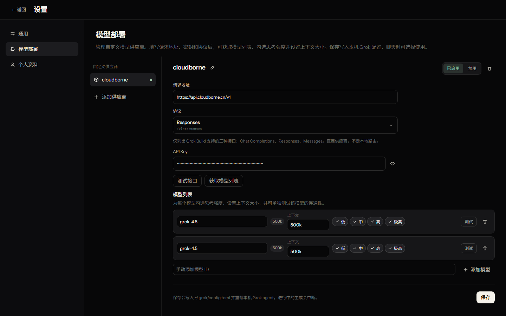
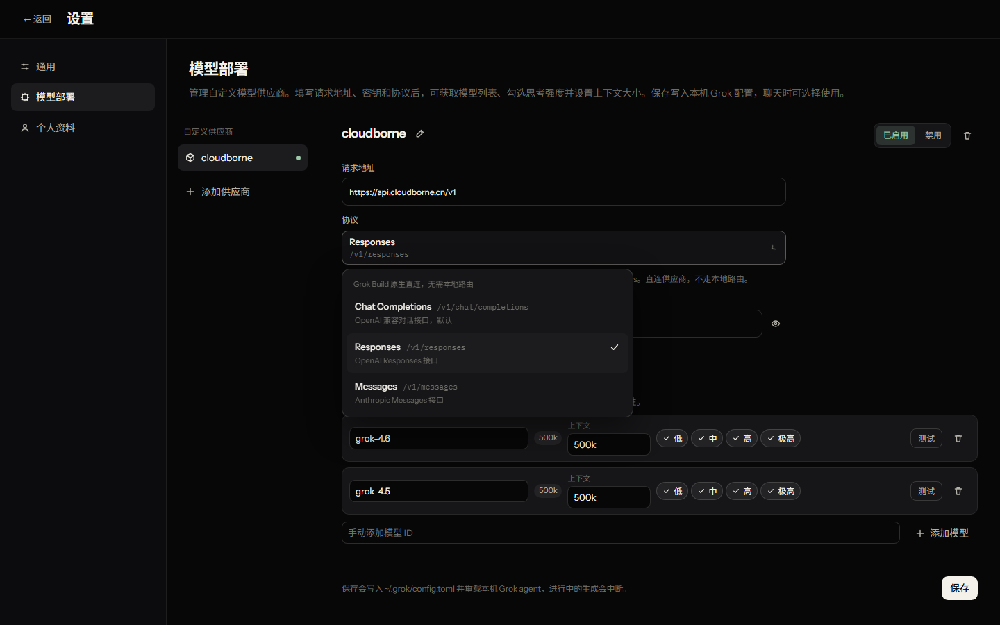

## 为什么做它

Grok Build 已经能在本机通过 CLI / TUI 工作，但长时间使用命令行时，项目切换、会话回看、文件预览和模型设置仍然分散在不同入口。这个项目把这些动作收进一个只绑定本机回环地址的 Web 工作台，浏览器负责界面，Grok agent 仍然在本机运行。

## 当前形态

左侧管理项目与历史会话，中间用文档流呈现对话，底部是输入坞。发送消息时，Vite 插件通过 ACP JSON-RPC 拉起 `grok agent --no-leader stdio`，把流式回复、工具调用和权限请求接回页面。未连接时界面会明确显示本机未连接，不把静态页面伪装成已经接通。

右侧栏可以打开审查、集成终端和文件预览。文件支持代码高亮、Markdown、PDF、图片和 DOCX 正文预览；对话里的本地路径可以直接打开，网页链接则通过 Ctrl+单击交给系统浏览器。

## 模型部署与边界

设置页可以登记自定义供应商、读取模型列表、配置思考强度和上下文大小，并单独测试模型推理。配置写入本机 `~/.grok/config.toml`，API Key 不进入仓库。工作台本身不修改 Grok Build 安装目录；服务默认只监听 `127.0.0.1`，并对 API 请求做同源和主机校验。

## 代码边界

前端状态集中在 `src/workspace.tsx`，服务端桥接位于 `server/`。会话正文继续由本机 Grok 管理，浏览器只保存工作台偏好和项目资料。当前仓库还保留了一份安全与状态机 issue 清单，用来记录修复依据和后续工作，不把未修复的问题包装成产品能力。

项目源码与安装说明：[qing-2114/grok-build-web](https://github.com/qing-2114/grok-build-web)
